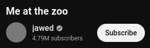

# YouTube Thumbnail Fix

[EN](README.md) / [RU](README.ru.md)

A simple extension for Chromium that fixes YouTube thumbnails in Russia.

## How does it work?

YouTube's CDN `yt3.ggpht.com` seems to be blocked by some Russian internet providers, so the channel thumbnails that rely on this specific CDN can't be loaded. This extension redirects all `yt3.ggpht.com` requests to `yt4.ggpht.com` which is basically the same thing.

## Installation

1. Download archive from the [latest release](https://github.com/gs256/youtube-thumbnail-fix/releases/latest)

2. Unpack it to a persistent folder, you won't be able to move it after the installation

3. Go to `chrome://extensions` in your browser

3. Turn on `Developer mode`

5. Click `Load unpacked` and select the recently unpacked `youtube-thumbnail-fix` folder