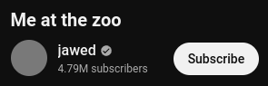

# YouTube Thumbnail Fix

[EN](README.md) / [RU](README.ru.md)

Небольшое расширение для хромиума, которое исправляет сломанные иконки на YouTube в России.

## Как оно работает?

CDN YouTube по адресу `yt3.ggpht.com` заблокировано некоторыми провайдерами, поэтому аватарки каналов могут не загружаться. Это расширение перенаправляет все запросы к `yt3.ggpht.com` на адрес `yt4.ggpht.com`, который доступен, через который можно получить все те же иконки.

## Установка

1. Скачать архив из [последнего релиза](https://github.com/gs256/youtube-thumbnail-fix/releases/latest)

2. Распаковать в удобную папку, т. к. после установки нельзя будет ее перенести

3. Перейти по адресу `chrome://extensions` в браузере

3. Включить `Режим разработчика`

5. Нажать `Загрузить распакованное расширение`, в открывшемся окне выбрать только что распакованную папку `youtube-thumbnail-fix`